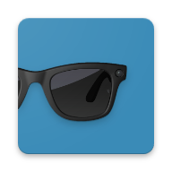
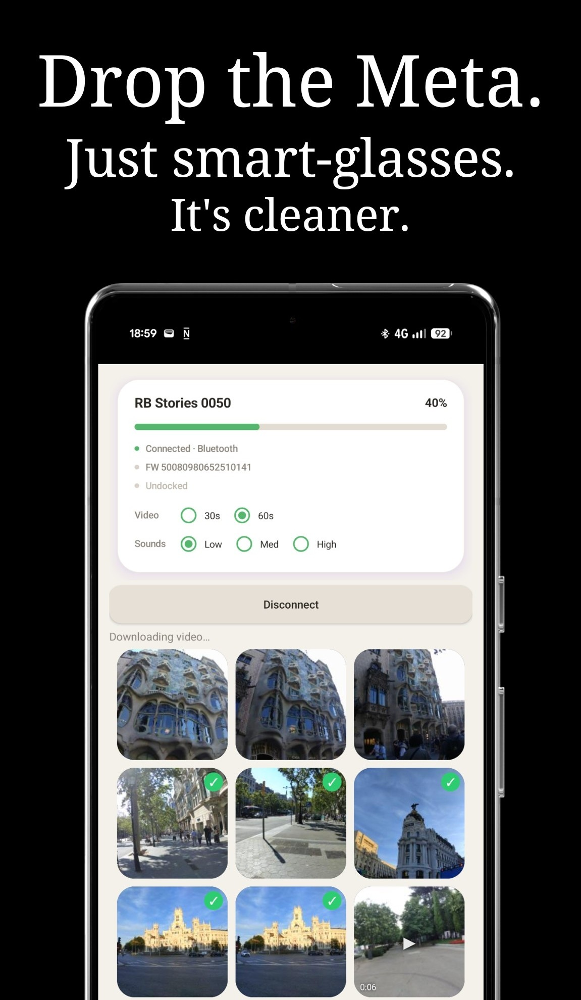
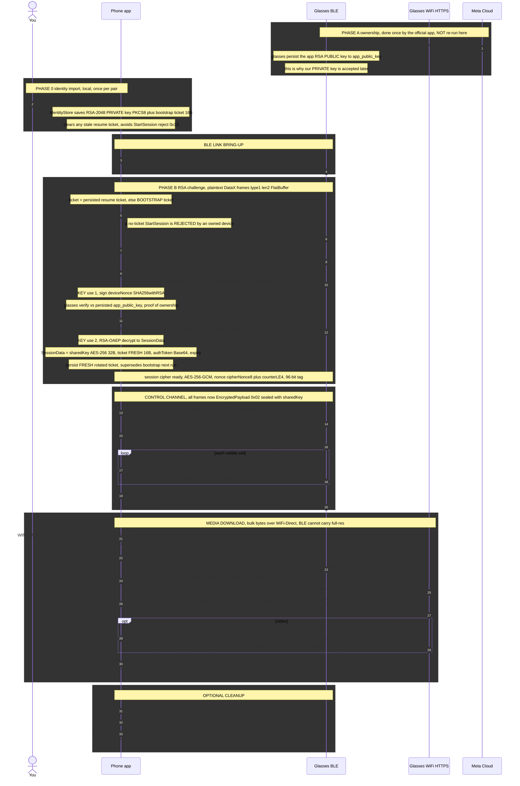

# Stories Client

<div align="center">



</div>

Standalone third party Android client for **Ray-Ban Stories (2021)** ("stella") glasses: connect over BLE, download full-resolution photos/videos over WiFi-Direct,
and manage the glasses without the official Meta app.

Kotlin rewrite of the earlier Java RE-focused prototype; built entirely from reverse-engineering the glasses firmware plus live BLE captures.

<p align="center">
  
</p>

Project started in May 2026 against Meta RayBan Gen 1 (the 4K glasses), briefly moved to Gen 2, no real progress for months, decided to find my old RayBan Stories from the pile of old tech junk, that was the charm that worked, less complexity and security (no airship).

## Motivation

Back in 2021, Facebook (Meta) released the Ray-Ban "Stories" camera smartglasses. It's first hardware product for broad appeal, Meta clearly learned from the Google Glass debacle and decided to partner with luxury eyewear brand Luxottica, the owners of the legendary Ray-Ban glasses to give it an air of legitimacy as well as to have an established brand carry it's tech. No one looks cool using Google Glass.

I got my pair in 2022, and despite the atrocious video quality, lackluster battery life and disconnection drops from my phone, it became a staple in my life, listening to podcast or catching up on work meetings while zipping around on my electric skateboard, snapping a quick photo while I'm out and about without needing to take my phone out, or getting POV video without having to use my GoPro. The LED light on the front was never an issue, since I barely took videos or photos with people close by, and if I did, it would often just spark a harmless conversation followed by me letting them try the glasses out and viewing the video afterwards.

The Stories glasses didn't sell well, and many people were unaware of them. [WSJ reported back in mid 2023 Meta estimated less than 10% of users actively wore theirs](https://www.wsj.com/tech/personal-tech/metas-ray-ban-smart-glasses-fail-to-catch-on-31f6ba4e).

But Meta/Luxottica hit the nail in the head with the release of the "RayBan Meta" (Gen 1) glasses in September 2023. Those glasses had better video quality, longer battery life and upgraded speakers. In 2025, they followed thru and upgraded them again, to Gen 2.

They sold more than [7 million of those in 2025 alone](https://www.uploadvr.com/meta-essilorluxottica-sold-7-million-smart-glasses-in-2025/)

When the Stories were first released, the app was simple to use. It allowed photo/video downloads, and you could optionally log into Facebook as well as turn on an AI assistant if you wanted to. 

In 2023, Meta started a journey into making their software as unappealing as possible to the glasses users.

- Mandatory login: When you open the app to bind to the glasses, you must sign in with a Meta account.
- An AI TikTok feed: who asked for this? The Facebook View app got rebranded to Meta View, then got shelved and brought back as Meta AI, an app which serves you AI generated video slop that happens to let you manage your glasses
- They not only [planned to add facial recognition technology into their glasses, meticulously aiming to release it during a "dynamic political environment" as a distraction measure](https://www.nytimes.com/2026/02/13/technology/meta-facial-recognition-smart-glasses.html) but actually went ahead and [turned our phones into unwitting nodes of a decentralized biometric capture system](https://www.wired.com/story/meta-smart-glasses-face-recognition-nametag-connections/) essentially planning to turn unsuspecting smartglass users into walking Flock cameras.
- They release actually useful features that run on the glasses firmware, such as a feature to boost other people's voices, [then went ahead and added a soft paywall for something which doesn't need server usage](https://www.theverge.com/gadgets/959899/meta-ai-glasses-paywall-rate-limit)
- Their [roadmap for new features to add to their next gen glasses](https://www.uploadvr.com/meta-still-internally-debating-privacy-of-always-on-ai-glasses/) isn't exactly encouraging either. 

They keep shoehorning [the useless AI assistant shit nobody wants to use](https://www.nytimes.com/2026/04/14/magazine/ai-sunglasses-meta-zuckerberg.html) into the glasses when all we wanted was to listen to music without headphones and get some video of us doing some activity without needing to use our hands to record.

And that brings us to the reason this project exists. 

In April 2026 I started probing how hard would it be to write my own client for Meta smartglasses, completely bypassing Meta AI app so I could uninstall it and keep using my glasses.

With the help of an LLM coding tool I mapped out the Meta app internals, grabbed the firmware from the glasses, reversed it and started to write the client. It proved extremely difficult. Meta has implemented a proprietary data transport called Airship to guard against RE efforts, as well as employed pretty much every trick in the book.

I put my rayban meta gen 1s aside, and just used regular sunglasses. Then I remembered my old rayban stories were stashed around somewhere, dusted them off, and probed again.

This time, I struck gold.

There was a regular HTTP webserver running on these, so on a cursory look it seemed very promising, I could just GET the photos and videos.

At this point (June 2026) nobody seemed to have fully reverse engineered the transport on neither the Meta Raybans (Gen1/2) or the Stories from 2021. The only promising lead was [this blogpost from code-byter](https://code-byter.com/2023/09/24/rayban-hacking.html).

So in July I got to work fully mapping how the transport works, from my understanding, it works like this:

- Meta AI app pairs with glasses over BLE, it grabs serial num and other details
- Data sent to Meta servers, Meta replies with a private key and bootstrap ticket (Phase A)
- Those 2 are loaded on the glasses as well as the pubkey loaded into the app
- I grabbed the priv key and bootstrap ticket and loaded it into Stories Client
- Transport is subsequently encrypted and encryption rotated using the bootstrap ticket
- WiFi direct is used on the phone, phone acts as AP, glasses are client
- DataX wrapped around BLE transport

How Stories Client works after Phase A is complete:



## Features

- **Pairing-free connect** to already-owned glasses: Needs Meta AI app once just for extracting secrets (see TODO).
- **Gallery**: 3-column squircle grid, newest first, BLE thumbnails (`get_asset_content_v2`), pull to
  refresh, new-capture notifications, synced badge for media already on the phone.
- **Detail view**: full-res preview when saved, metadata, `HDR|BURST · 0 · LEFT` frame picker driven by
  the per-frame `ImageAssetMetadata.ev` (median-EV right frame = main; bracket vs burst detected per scene).
- **Download** over WiFi-Direct (phone = group owner, `stationmode_connect` + `start_webserver`), with live
  progress; MP4 downloads also fetch the IMU/gyro sidecar `.bin` for Gyroflow. Saved to `DCIM/StoriesClient`
  as `stories_<cid8>[suffix].<jpg|mp4|bin>`.
- **Delete** a capture off the glasses (32-hex id guard; byte-exact request), only offered after a save.
- **Undistort**: fisheye -> rectilinear (Kannala-Brandt) for 2592x1944 photos, saved as `_rect.jpg`.
- **Status pill**: glasses battery, case battery, storage level, firmware, plus two MCU settings
  (video length 30/60 s, system sounds level) read and written live.
- **Debug log drawer**: long-press the pill.

## Identity

Nothing sensitive ships in the APK. Tap **Load keys…** and pick a JSON with the owner identity
(`app_rsa_priv_pkcs8_b64`, `bootstrap_ticket_hex`, optional `serial` / `device_label`). The rotating
resume ticket is persisted per session. See `EXTRACT_SECRETS_CONFIG.md` in the research repo for how the
identity is extracted from an owning phone.

## Roadmap / TODO

1) Extract RSA private key and bootstrap ticket. WIP.

Two possible ways:

- Frida hook (how I did it)
- Meta AI smali patch + adb logging

A gift:

`264.0.0.18.167` code `464402080`

[APKMirror](https://www.apkmirror.com/apk/facebook-2/facebook-view/meta-ai-vibes-ai-glasses-264-0-0-18-167-release/meta-ai-vibes-ai-glasses-264-0-0-18-167-3-android-apk-download/)

Hook:

- `X.C67273Za->ADX([B)` the `[B` is the privkey
- `X.C25043CsG->AEk([B)` holds the ticket

2) RayBan Meta Gen 1 / Gen 2 (Supernova) support:

In progres... been at it for ~7 months now. RE'ing the RayBan stories was a byproduct of that which turned out to be easier.

## Building

Toolchain: Gradle 8.7 wrapper, AGP 8.5.2, Kotlin 1.9.24, JDK 17+ (JDK 21 used), compileSdk 34, minSdk 29.

```
./gradlew assembleDebug        # -> app/build/outputs/apk/debug/app-debug.apk
./gradlew testDebugUnitTest    # wire-format golden tests
```

## Layout

| package | role |
|---|---|
| `datax/` | DataX framing `[type:1][size:2 LE][payload]`, MTU chunking + reassembly |
| `proto/` | hand-rolled FlatBuffers reader/writer + `stella.security` / `stella.srvs` message layouts |
| `auth/` | identity store, Phase-B handshake, AES-256-GCM `EncryptedPayload` codec |
| `ble/` | GATT transport for the DataX characteristic; CompanionDeviceManager discovery |
| `control/` | encrypted RPC channel: 45-service registration, capture listing, thumbnails, device state, MCU settings, webserver bring-up, delete |
| `media/` | webserver HTTPS client, MediaStore saver, synced index, photo undistortion |
| `wifi/` | WiFi-Direct group host (used) and SoftAP joiner (alternative transport) |
| `ui/` | status pill, gallery cells/adapter, detail overlay, progress bar |


## LLM usage

Claude Code was used, with models spanning Opus 4.6, 4.7, 4.8 and 5. Fable refuses to work on this.

Next up: trying out Z Ai / Moonshot Ai models such as Kimi and GLM. [Less guardrails for RE on those models](https://ericpardee.github.io/fire-hd-ownership/)

## Tests

`app/src/test` holds golden-vector tests: every registration frame, request body, security message and
the session cipher are compared byte-for-byte against vectors generated from the validated Java
implementation (`golden_wire.txt`). Run them before touching anything in `control/` or `proto/`.

## Disclaimer

This project is most definitively not affiliated with or endorsed by Meta Platforms, Inc. or Luxottica Group S.p.A. "Meta", "Stories" and "Ray-Ban" are trademarks of their respective owners.